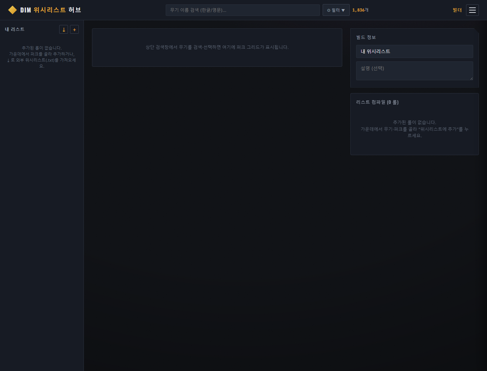
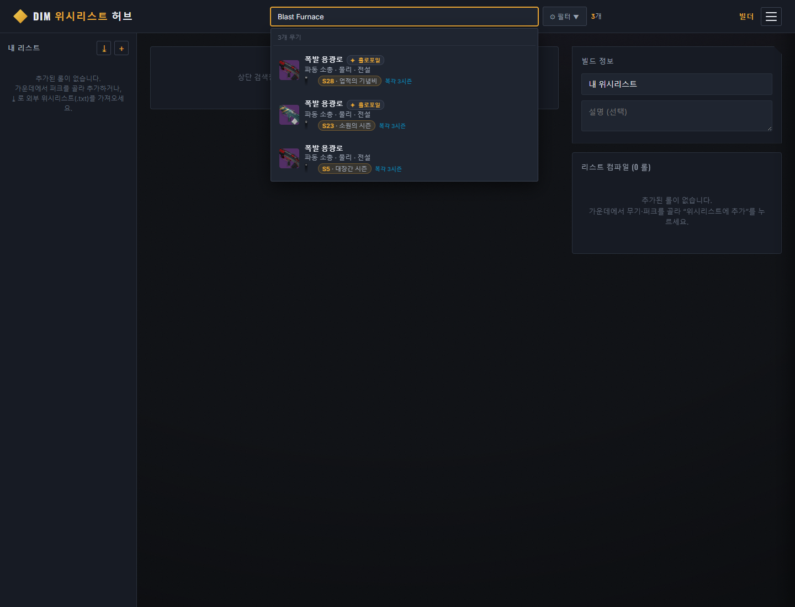
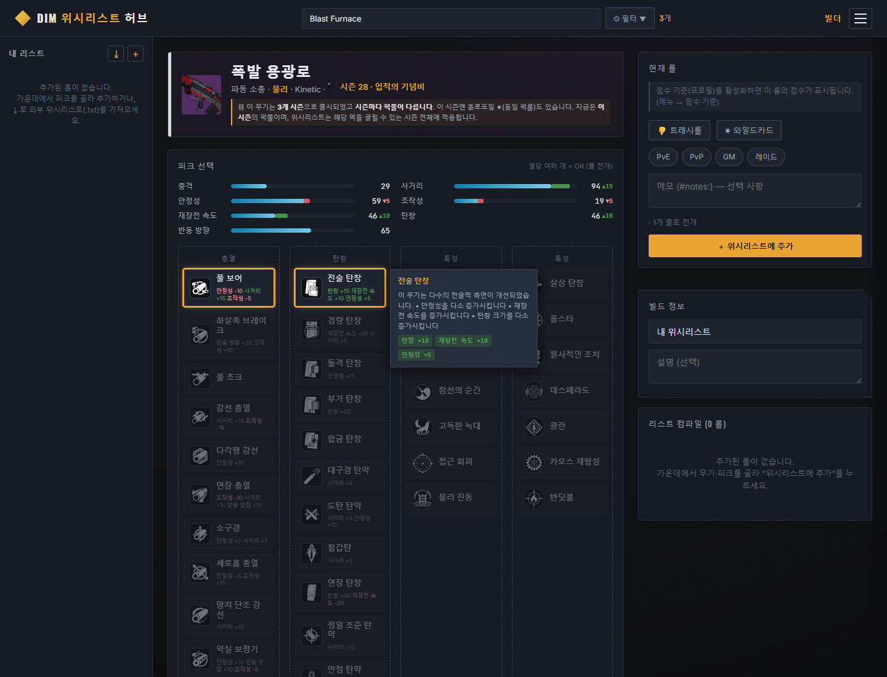

# DIM Wishlist Maker Hub

데스티니 가디언즈(Destiny 2) 유저가 웹에서 무기와 퍽을 선택해 **DIM(Destiny Item Manager) 호환 위시리스트**를 만들고, 가져오고, 점수화하고, 내 창고 정리까지 이어갈 수 있는 로컬 웹앱이다.

핵심 목표는 두 가지다.

- **시각적 편의성**: 해시값을 직접 다루지 않고 무기/퍽을 검색하고 클릭해서 롤을 구성한다.
- **데이터 정확성**: Bungie 매니페스트, 시즌/복각/홀로포일 변형, DIM 위시리스트 포맷 규칙을 최대한 정확히 반영한다.

## 현재 상태

- 구현 상태: 주요 기능 구현 및 검증 완료
- 기본 실행 방식: Docker Compose 또는 로컬 개발 서버
- 기본 접근 범위: 단일 사용자 로컬 도구, published 포트는 기본 `127.0.0.1` 바인딩
- 데이터 모드: Bungie API 키 없이 시드 데이터로 즉시 구동, API 키 설정 시 실제 매니페스트 적재 가능
- 테스트: 백엔드 단위 테스트 74개 기준
- 보안 검증: 정적/런타임 21개 항목 기준

## 실제 화면 캡처

아래 이미지는 로컬 앱(`http://127.0.0.1:5173`)을 실제로 실행한 뒤 캡처한 화면이다. 검색 예시는 `Blast Furnace`이며, 앱에는 한국어 매니페스트 이름인 `폭발 용광로`로 표시된다.

### 빌더 기본 화면



### 무기 검색 결과



### 선택된 무기 빌더 화면



## 문서 기준

루트 README는 전체 프로젝트의 입구다. 기능 상세, 변경 이력, API/DB 구조, 실행 환경, 보안 검증은 `docs/MD/` 문서를 기준으로 관리한다.

| 문서 | 역할 |
|---|---|
| [docs/MD/README.md](docs/MD/README.md) | 문서 인덱스 |
| [docs/MD/01-진행기록.md](docs/MD/01-진행기록.md) | 날짜별 업데이트/변경 이력 |
| [docs/MD/02-기능명세.md](docs/MD/02-기능명세.md) | 현재 구현된 기능, 부분 구현, 미구현 항목 |
| [docs/MD/03-아키텍처-API.md](docs/MD/03-아키텍처-API.md) | 기술 스택, 디렉터리 구조, DB 스키마, API 엔드포인트 |
| [docs/MD/04-개발환경-실행.md](docs/MD/04-개발환경-실행.md) | Docker/로컬 실행, 데이터 적재, 환경 트러블슈팅 |
| [docs/MD/05-보안검증.md](docs/MD/05-보안검증.md) | 위협 모델, 보안 조치, 자동 검증 절차 |
| [docs/MD/06-GitHub-업로드-체크리스트.md](docs/MD/06-GitHub-업로드-체크리스트.md) | GitHub 업로드 전 포함/제외/검증 체크리스트 |

## 기능 명시 점검 결과

기능 명세는 [docs/MD/02-기능명세.md](docs/MD/02-기능명세.md)에 사용자 흐름과 내부 규칙 중심으로 정리되어 있으며, `✅ 구현·검증`, `🟡 부분`, `⛔ 미구현` 상태 표기가 있다. 현재 문서상 주요 기능은 충분히 명시되어 있고, 미구현 항목은 GitHub Gist 자동 게시로 별도 분리되어 있다.

README에는 전체 프로젝트를 처음 보는 사람이 흐름을 잡을 수 있도록 아래 수준의 기능 요약만 둔다. 세부 조건, API, 예외, 검증 근거는 기능 명세와 아키텍처 문서를 기준으로 확인한다.

## 주요 기능

| 영역 | 내용 | 상태 |
|---|---|---|
| 무기 검색/필터 | 헤더 검색, 자동완성, 컨텍스트 인지 패싯, 속성/종류/등급/슬롯/탄약/프레임/기원/시즌 필터, 15스탯 min/max, 퍽 보유/제외 | 구현 |
| DIM식 텍스트 쿼리 | `is:`, `perkname:`, `stat:`, `season:`, `frame:`, `origin:`, `and/or/not`, 괄호 지원 | 구현 |
| 변형/복각/시즌 처리 | 홀로포일, 에이뎁트, 시즌별 복각 구분, watermark 기반 시즌 라벨, 변형 그룹 자동 전개 | 구현 |
| 비주얼 퍽 빌더 | 무기별 컬럼 퍽 풀, 퍽 설명/스탯 델타 툴팁, 실시간 스탯 패널, 인기도 막대 | 구현 |
| DIM 위시리스트 컴파일 | 다중 퍽 OR를 다중 줄로 전개, 트래시 롤, 와일드카드, 태그, 메모, LF/BOM 없음 | 구현 |
| 위시리스트 가져오기 | 외부 DIM `.txt` 파싱, 헤더/주석/노트 처리, 카르테시안 전개 역병합, 실제 열 매핑 | 구현 |
| 위시리스트 내보내기 | 완성 목록 미리보기, `.txt` 다운로드, 시드 모드 경고 | 구현 |
| 점수화 | 위시리스트 기반 퍽 선호도/조합 학습, 스코프 블렌드, 열 비중, coverage, 퍽별 점수 배지 | 구현 |
| 내 창고 정리 | Bungie OAuth 또는 데모 창고, 보유 무기 채점, 정리 후보, DIM 트래시리스트 내보내기 | 구현 |
| 커뮤니티 메타 | voltron 기반 인기 무기/퍽 인기도 대시보드 | 구현 |
| 보안 검증 | 로컬 바인딩, SQLi/XSS/DoS/OAuth state/비밀 노출 점검 스크립트 | 구현 |
| GitHub Gist 자동 게시 | DIM URL 붙여넣기 흐름 복원용 Gist 게시 | 향후 |

## 기술 스택

| 영역 | 스택 |
|---|---|
| 프론트엔드 | React 18, Vite 5, TypeScript |
| 백엔드 | FastAPI, Uvicorn, Pydantic v2 |
| DB | SQLite |
| 데이터 적재 | Python, httpx, Bungie Manifest API, voltron.txt |
| 배포 | Docker Compose, nginx 정적 서빙 및 `/api` 프록시 |
| 인증 | Bungie OAuth Public/Confidential, scope 64 |

## 프로젝트 구조

```text
DIM_Wishlist_hub/
├─ backend/                  FastAPI API, DIM 컴파일러, 점수화 엔진, 테스트
│  ├─ app/
│  │  ├─ compiler.py         DIM 위시리스트 컴파일/파서
│  │  ├─ query.py            DIM식 텍스트 검색 쿼리 언어
│  │  ├─ scoring.py          위시리스트 기반 점수화
│  │  ├─ seasons.py          watermark→시즌 매핑
│  │  └─ routers/            weapons, wishlist, scoring, auth, inventory, meta
│  ├─ seed/                  시드 데이터 생성/샘플 데이터
│  └─ tests/                 compiler/query/scoring 단위 테스트
├─ frontend/                 Vite + React + TypeScript SPA
│  └─ src/components/        빌더, 검색, 퍽 그리드, 점수 기준, 창고, 메타 UI
├─ ingest/                   Bungie 매니페스트/voltron 적재 파이프라인
├─ docker/                   backend/frontend Dockerfile, nginx 설정
├─ scripts/                  dev-local, security_check, LAN helper
├─ data/                     SQLite 산출물, git 미추적 대상
├─ docs/MD/                  기능/변경/아키텍처/실행/보안 문서
├─ docker-compose.yml
└─ README.md
```

## 빠른 시작: Docker Compose

`.env.example`을 `.env`로 복사하고 필요한 값을 채운다. Bungie API 키가 없어도 시드 데이터로 앱은 실행된다.

```bash
docker compose up -d --build
```

실행 후 접근 주소:

- 앱: `http://localhost:8080`
- 백엔드 Swagger: `http://localhost:8000/docs`

실제 Bungie 매니페스트와 커뮤니티 메타 데이터를 적재하려면 다음을 실행한다.

```bash
docker compose run --rm ingest
docker compose restart backend
```

Docker 배포에서는 nginx가 `/api/*` 요청을 백엔드로 프록시하고, SQLite 데이터는 `dimdata` 볼륨에 영속된다.

## 로컬 개발 실행

### 백엔드

```bash
cd backend
python -m venv .venv
.venv\Scripts\activate
pip install -r requirements.txt
uvicorn app.main:app --reload
```

백엔드 문서:

- API: `http://127.0.0.1:8000/docs`
- 상태: `http://127.0.0.1:8000/status`

### 프론트엔드

일반 로컬 디스크에서는 다음으로 실행한다.

```bash
cd frontend
npm install
npm run dev
```

프론트엔드 주소:

- `http://127.0.0.1:5173`

이 머신처럼 WebDAV 가상 드라이브에서 Vite/esbuild/rollup 경로 문제가 나는 환경에서는 루트에서 래퍼를 사용한다.

```bash
node scripts/dev-local.mjs
```

자세한 환경별 주의사항은 [docs/MD/04-개발환경-실행.md](docs/MD/04-개발환경-실행.md)를 확인한다.

## 실제 데이터 적재

1. [Bungie Application](https://www.bungie.net/en/Application)에서 API Key를 발급한다.
2. 루트 `.env`에 `BUNGIE_API_KEY=...`, `MANIFEST_LOCALE=ko`를 설정한다.
3. 매니페스트와 메타 데이터를 적재한다.

```bash
python -m ingest.manifest_ingest
python -m ingest.voltron_bootstrap
```

적재 산출물은 기본적으로 `data/app.sqlite`에 생성된다. 실 DB가 없으면 백엔드는 `backend/seed/seed_data.json` 기반 시드 캐시로 동작한다.

## DIM 위시리스트 포맷 규칙

컴파일러는 DIM 위시리스트 파서와 호환되는 텍스트를 생성한다.

- `perks=A,B`의 쉼표는 AND다.
- 같은 열의 다중 선택은 OR로 보고 여러 `dimwishlist:` 줄로 전개한다.
- 한 롤의 카르테시안 조합은 최대 2000개로 제한한다.
- 강화 퍽은 기본 퍽 해시로 정규화해 출력한다.
- 트래시 롤은 item hash를 음수화한다.
- 와일드카드는 `item=-69420`이며 desirable 전용이다.
- `#notes:`의 `|` 문자는 제거한다.
- 출력은 LF 개행, BOM 없음이다.

세부 구현은 [backend/app/compiler.py](backend/app/compiler.py)와 [docs/MD/03-아키텍처-API.md](docs/MD/03-아키텍처-API.md)의 컴파일러 섹션을 기준으로 한다.

## 주요 API

| 경로 | 설명 |
|---|---|
| `GET /status` | 데이터 소스, 매니페스트 버전, 무기 수, Bungie 키 설정 여부 |
| `GET /weapons` | 무기 검색과 필터링 |
| `GET /weapons/count` | 현재 검색/필터 매칭 수 |
| `GET /filters` | 컨텍스트 인지 필터 패싯 |
| `GET /weapons/{hash}` | 무기 상세와 퍽 풀 |
| `POST /compile` | 단일 롤 DIM 줄 미리보기 |
| `POST /export` | 전체 위시리스트 `.txt` 생성 |
| `POST /import-wishlist` | 외부 DIM `.txt` 가져오기 |
| `GET/POST/DELETE /scoring-profiles` | 점수 프로필 관리 |
| `POST /score` | 선택 롤 점수화 |
| `POST /score/perk-weights` | 무기 퍽별 가중치 계산 |
| `GET /auth/bungie/login` | Bungie OAuth 시작 |
| `POST /me/sync` | Bungie 창고 동기화 |
| `POST /me/cleanup` | 보유 무기 정리 후보 계산 |
| `GET /meta/top-weapons` | 커뮤니티 인기 무기 |

전체 API 목록과 스키마는 [docs/MD/03-아키텍처-API.md](docs/MD/03-아키텍처-API.md)를 확인한다.

## 검증

백엔드 단위 테스트:

```bash
cd backend
python -m unittest discover -s tests
```

보안 검증은 앱 또는 백엔드가 실행 중인 상태에서 수행한다.

```bash
python scripts/security_check.py
```

백엔드 직접 검증:

```bash
SECCHK_BASE=http://127.0.0.1:8000 python scripts/security_check.py
```

Windows PowerShell에서는 다음처럼 환경변수를 지정한다.

```powershell
$env:SECCHK_BASE="http://127.0.0.1:8000"; python scripts/security_check.py
```

## 보안 모델

이 프로젝트는 기본적으로 **단일 사용자 로컬 도구**다.

- Docker published 포트는 기본 `127.0.0.1`에 바인딩한다.
- API 키와 OAuth 시크릿은 `.env`에서 읽고 응답으로 노출하지 않는다.
- `.env`와 SQLite 데이터는 git/docker 이미지에서 제외한다.
- SQL 값은 파라미터 바인딩을 사용하고, 텍스트 쿼리 키/연산자는 화이트리스트 기반이다.
- 입력 DoS 방지를 위해 import 크기와 롤 조합 수를 제한한다.

LAN 또는 공개망에 노출하려면 별도 인증과 토큰 저장 정책을 추가해야 한다.

## 알려진 환경 주의사항

이 작업 환경에서 확인된 특이점은 다음과 같다.

- WebDAV 가상 드라이브에서 Vite dev/build가 `Z:\...` 경로 문제로 실패할 수 있다. 이 경우 `node scripts/dev-local.mjs`를 사용한다.
- 전역 npm 설정에 `os=linux`가 있으면 Windows용 Rollup/esbuild 바이너리가 설치되지 않을 수 있다.
- Python 3.8 32-bit 환경을 고려해 `uvicorn[standard]` 대신 plain `uvicorn`을 사용한다.

자세한 해결 절차는 [docs/MD/04-개발환경-실행.md](docs/MD/04-개발환경-실행.md)에 정리되어 있다.

## 향후 작업

현재 명시된 주요 미구현 항목은 **GitHub Gist 자동 게시**다. DIM이 GitHub 호스팅 URL을 허용하는 흐름을 복원하기 위한 기능이며, 현재는 `.txt` 다운로드 방식이 기본이다.

그 밖의 변경 이력과 다음 후보는 [docs/MD/01-진행기록.md](docs/MD/01-진행기록.md)를 기준으로 관리한다.